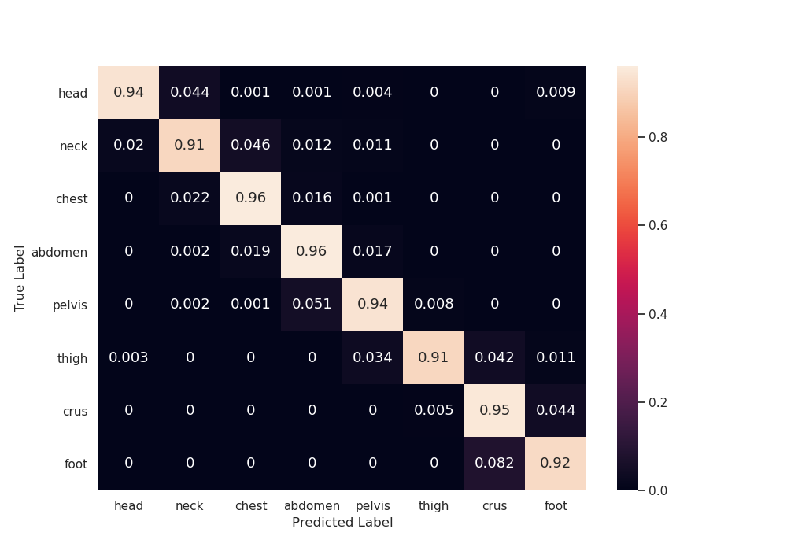

## Table of Contents
+ [API documentation](#api-lnk)
    + [AWS Sagemaker](#api-sagemaker)
    + [AWS CLI - NIFTI file](#api-awscli-nifti)
    + [AWS CLI - S3 URI](#api-awscli-s3)
    + [AWS Boto3 - NIFTI path](#api-boto3-nifti)
    + [AWS Boto3 - S3 URI](#api-boto3-s3)
    + [curl - NIFTI file](#api-nifti)
    + [curl - S3 URI](#api-s3)
+ [Technical Details on Core Algorithm](#paper-lnk)
    + [Introduction](#paper-intro)
    + [Materials and Methods](#paper-mm)
    + [Results](#paper-results)
    + [Discussion](#paper-discussion)
    + [References](#paper-ref)
    + [References](#paper-app)


## API documentation <a name="api-title"></a>

### AWS Sagemaker <a name="api-sagemaker"></a>

+ [example jupyter notebook](../ct-scan-body-part-detector.ipynb) for creating and using the endpoint model.


### AWS CLI - NIFTI file <a name="api-awscli-s3"></a>

+ create `inference.sh` file using below command block.

```
#!/bin/bash
export ENDPOINTNAME=$1
export S3_URI=$2
export MYJSON='{"s3_uri":"'${S3_URI}'"}'

aws sagemaker-runtime invoke-endpoint \
  --endpoint-name "$ENDPOINTNAME" \
  --content-type "application/json" \
  --cli-binary-format raw-in-base64-out \
  --body ${MYJSON} \
  output.json

cat output.json
```

+ sample inference command is provided below, replace `myendpoint` and `s3://myawsregion.1234/images.nii.gz` with model endpoint name and a valid s3 uri to a compressed Nfti file (ext `.nii.gz`).

```
bash inference.sh myendpoint s3://myawsregion.1234/images.nii.gz
```

### AWS CLI - S3 URI <a name="api-awscli-nifti"></a>

+ create `inference.sh` file using below command block.

```
#!/bin/bash
export ENDPOINTNAME=$1
export FILEPATH=$2

aws sagemaker-runtime invoke-endpoint \
  --endpoint-name "$ENDPOINTNAME" \
  --content-type "application/niigz" \
  --body "fileb://$FILEPATH" \
  output.json

cat output.json
```

+ sample inference command is provided below, replace `myendpoint` and `image.nii.gz` with model endpoint name and a valid path to a compressed Nfti file (ext `.nii.gz`)

```
bash inference.sh myendpoint s3://myawsregion.1234/images.nii.gz
```


### AWS Boto3 - NIFTI path <a name="api-boto3-nifti"></a>

+ see [example jupyter notebook](../ct-scan-body-part-detector.ipynb) for code snippet.


### AWS Boto3 - S3 URI <a name="api-boto3-s3"></a>

+ see [example jupyter notebook](../ct-scan-body-part-detector.ipynb) for code snippet.


### curl - S3 URI <a name="api-s3"></a>

+ create `inference.sh` file using below code block.

```
#!/bin/bash
export ENDPOINTURL=$1
export S3URI=$2
export MYJSON='{"s3_uri":"'${S3URI}'"}'

curl --header "Content-Type: application/json" \
  --request POST \
  --data ${MYJSON} \
  --out output.json \
  ${ENDPOINTURL}/invocations

cat output.json
```

+ sample inference command is provided below, replace `localhost:8080` and `s3://myawsregion.1234/images.nii.gz` with model endpoint url and a valid s3 uri to a compressed Nfti file (ext `.nii.gz`).

```
bash inference.sh localhost:8080 s3://myawsregion.1234/images.nii.gz
```


### curl - NIFTI file <a name="api-nifti"></a>

+ create `inference.sh` file using below code block.

```
#!/bin/bash
export ENDPOINTURL=$1
export FILEPATH=$2

curl -X POST \
  --header "Content-Type: application/niigz" \
  --data-binary @${FILEPATH} \
  --out output.json \
  ${ENDPOINTURL}/invocations

cat output.json
```

+ sample inference command is provided below, replace `localhost:8080` and `images.nii.gz` with model endpoint url and a valid path to a compressed Nfti file (ext `.nii.gz`).

```
bash inference.sh localhost:8080 image.nii.gz
```


## Technical Details on Core Algorithm <a name="paper-lnk"></a>

Author. Pangyu Teng, Sawtelle LLC. 2021-10-01
### Introduction <a name="paper-intro"></a>

Medical image processing pipelines can be at times complex and resource intensive. One fundamental step is selecting the scan of interest based on presence of anatomy. When thousands and millions of images need to be analyzed, manually selecting the scans of interest may become a daunting, time consuming task and could potentially hinder downstream processes.  With the recent advances in deep learning, Roth et al[1] demonstrated the feasibility of using convolutional neural network to classify computed tomography (CT) axial images into 5 classes of body parts (neck, lungs, liver, pelvis and legs).  Leveraging Roth's body part classifier, Harris et al[2] showed that image labeling (identifying the series of interest) for oncology clinical trials can be achieved with a much higher throughput than manual labeling.  While there are numeraous open-source convolutional neural network based image classification solutions,[3] to the best our knowledge, there is no commercially available or open-source algorithms for classification of axial CT image (as of 2021-10-01).  Inspired by Roth and Harris's work [1,2], we describe our implementation of `ct-scan-body-part-detector`, which is available in AWS Marketplace.

### Materials and Methods <a name="paper-mm"></a>
#### Data and Labeling

CT axial images (n=238,151) from 944 series were obtained from The Cancer Imaging Archive [4].  Eight body-parts were used as labels and were associated to each CT axial image: `head`, `neck`, `chest`, `abdomen`, `pelvis`, `thigh`, `crus` and `foot`.  Amazon Web Service Mechanical Turk was used for image labeling and were given the following definition for each class.

| class | definition |
| --- | --- |
| head | image containing the skull. |
| neck | between head and chest (containing shoulder) |
| chest | containing lung cavity. |
| abdomen | between chest and pelvis. |
| pelvis | containing pelvic bone. |
| thigh | between pelvis and crus. |
| crus | below mid-point of knee, above the ankle with no presence of foot. |
| foot | presence of foot. |

An expert with 15 years of experience in medical image processing (`expert-0`) reviewed the image/label pairs. Pairs that did not meet the above label definition were flagged and sent back to Mechanical Turk to relabel until the labels were agreed upon by `expert-0`.

The distribution of classes are as follows:

| class | count (percentage) |
| --- | --- |
| head | 8,628 (3.62 %) |
| neck | 10,594 (4.45 %) |
| chest | 167,618 (70.38 %) |
| abdomen | 37,743 (15.85 %) |
| pelvis | 12,066 (5.07 %) |
| thigh | 590 (0.25 %) |
| crus | 647 (0.27 %) |
| foot | 265 (0.11 %) |

Axial images were then spilt to train, validation and test sets following a 6:2:2 ratio, stratified by class, translating to n of 142,890, 47,630 and 47,631 axial images respectively.

#### Model Overview and Hyper-parameters

Prior to model training, CT axial images (typically of shape `(1,512,512)`) were down sampled to shape of `(1,128,128)` and the image intensity was scaled from `-1000, 1000` to `0, 1`. We termed the input image as `X`, where each image is associated to a ground truth label `y`.

The convolutional neural network model architecture consists of 3 main modules: encoder, decoder and a bottle-neck network, and was inspired by several prior published archtectures: Res-net, U-net, and Xception [5-8].

```
# psuedo code                       # input shape   | output shape
enc_out = encoder(X)                # (1,128,128)   |    (8,8,256)
X_hat = decoder(enc_out)            #   (8,8,256)   |  (1,128,128)
y_hat = bottle_neck(enc_out)        # (1,128,128)   |          (8)

loss = cross_entropy_loss + mse_loss
cross_entropy_loss = cross_entropy(y,y_hat,w)
mse_loss = mse(X,X_hat)
```

In short, the `encoder` and `decoder` takes in `X` and attempts to predict an image (`X_hat`), whereas the `bottle_neck` network uses the output from the encoder (`enc_out`) to predict a label (`y_hat`) for the image.

Since the collected data is unbalanced, with the majority of images being within the chest and abdomen, during training, categorical cross-entroy was weighted based on class distribution (`w`).  The final loss function (`loss`) consists of two terms:
where `cross_entropy_loss` is the weighted categorical cross entropy loss and `mse_loss` is the mean squared error.  To further prevent model from overfitting, additional measures were opted during training:

+ Data augmentation.
+ Triangular cyclic learning rate.
+ Early stopping with patience set at 20 epochs.

Final weight of the model was selected from the epoch with the smallest validation loss.

### Results <a name="paper-results"></a>

Test set achieved a 95.7% accuray, confusion matrix (CM), normalized over the total truth count (row) is displayed below (train, validation test values available in Appendix.)

| Confusion Matrix |
| --- |
|  |

Accuracies by label range from 91 to 97%, with false positives mainly residing in adjacent body parts. For example, within neck images, our model misclassified images as head and chest, 2.5% and 4.3% respectively, while correctly identifying the remaining 91% of the neck images.

#### Discussion and Applications <a name="paper-discussion"></a>

We have implemented a convolutional neural network for detection of body parts for CT axial images.  The data and models proposed in [1], [2] and the proposed are all close sourced, thus performance comparison among these models offers little value.  Nevertheless, we show the differences in body range of the collected images, sample size and the model accuracies of these three methods below.

|  | Roth [1] | Harris [2] | Proposed | 
| --- | --- | --- | ---|
| body range | neck-leg| head-thigh | head-foot |
| total sample size | 4298 | 26,400 | 238,151 |
| accuracy (%) | 94.1 | 95.8 | 95.7 |

As shown in the above table, we were able to collect and label 9 times more images than Harris by leveraging TCIA's publicly available database [4] and low cost high-throughput labeling via AWS Mechanical Turk.  Interestingly, while the datasets used can be assumed to be different, the accuracies reported by these 3 methods are quiet comparable, a weak indication of no over-fitting by all three methods (loss plot of our proposed method is provided in `Section Appendix`).

Application wise, in addition to using image classifiers to identify images of interest, the predicted labels can be combined to determine the height of each body part.  Further, assuming images within DICOM series are contiguous, the output from the proposed method can be used to determine body part completeness, which is useful for quality checks and is a crucial logic for determining disease progression in oncology trials.[9]

We provide more detail below on how our API performs model inference and consumes the predicted label to output body_part heights and chest-abdomen-pelvis (CAP) completeness:

For body part heights, predicted label of the same class is multiplied with the z-spacing to obtain the height of each body part. For example, for a given series with z-spacing of 2 mm, if our model predicted 10 slices of chest and 20 slices of abdomen, the height of the body parts will then be 20mm and 40mm for chest and abdomen, respectively.  Given the higher false positive rates in the lower extremity, classes `thigh`, `crus`, `foot` are lumped to class `lower_limb`.

For CAP completness, for a given series, and for each of the CAP region, the algorithm would claim a complete body part of the adjacent body parts also have a height greater than 0.  For example, to determine completness for chest, the following 3 criteria need to be fulfilled. 1) height for neck or head > 0 mm. 2) height for chest > 0mm and 3) height for abdomen > 0 mm.

### References <a name="paper-ref"></a>

[1] Roth, Holger R., et al. "Anatomy-specific classification of medical images using deep convolutional nets." 2015 IEEE 12th international symposium on biomedical imaging (ISBI). IEEE, 2015. https://arxiv.org/pdf/1504.04003.pdf

[2] Robert, J. Harris, et al. "High-throughput image labeling and quality control for clinical trials using machine learning." (2018). https://pesquisa.bvsalud.org/portal/resource/pt/sea-200902

[3] Canziani, Alfredo, Adam Paszke, and Eugenio Culurciello. "An analysis of deep neural network models for practical applications." arXiv preprint arXiv:1605.07678 (2016). https://arxiv.org/pdf/1605.07678.pdf

[4] Prior, Fred, et al. "The public cancer radiology imaging collections of The Cancer Imaging Archive." Scientific data 4.1 (2017): 1-7. https://www.nature.com/articles/sdata2017124

[5] Ronneberger, Olaf, Philipp Fischer, and Thomas Brox. "U-net: Convolutional networks for biomedical image segmentation." International Conference on Medical image computing and computer-assisted intervention. Springer, Cham, 2015. https://arxiv.org/abs/1505.04597

[6] He, Kaiming, et al. "Deep residual learning for image recognition." Proceedings of the IEEE conference on computer vision and pattern recognition. 2016. https://arxiv.org/abs/1512.03385

[7] Chollet, François. "Xception: Deep learning with depthwise separable convolutions." Proceedings of the IEEE conference on computer vision and pattern recognition. 2017. https://arxiv.org/abs/1610.02357

[8] Antonelli, Michela, et al. "The Medical Segmentation Decathlon." arXiv preprint arXiv:2106.05735 (2021). https://arxiv.org/pdf/2106.05735.pdf

[9] Eisenhauer, Elizabeth A., et al. "New response evaluation criteria in solid tumours: revised RECIST guideline (version 1.1)." European journal of cancer 45.2 (2009): 228-247. https://www.sciencedirect.com/science/article/abs/pii/S0959804908008733

### References <a name="paper-app"></a>

+ Loss plot (loss = cross_entropy_loss+mse_loss), final weight corresponds to weight at epoch 20 (green arrow).


+ Accuracies (%) and confusion matrices (CM), normalized over the total truth count (row), for train, validation, test sets are displayed below.

| | train | validation | test |
| --- | --- | --- | --- |
| accuracy (%) | 95.6 | 95.6 | 95.7 |
| mse loss | 0.00211 | 0.00212 | 0.00212 |
| categorical loss | 0.123 | 0.123 | 0.120 |
| CM |  |  |  |
